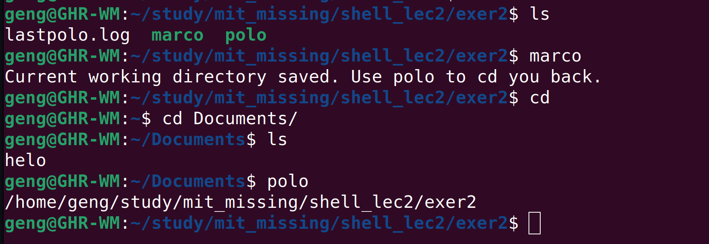

# marcopolo

**Our Philosophy**: **Optimize for the common case!**

**NOTICE**: Use **[autojump](https://github.com/wting/autojump)** to achieve much much more powerful directory switching.

save current working directory and cd you back anytime, anywhere, even if the terminal is restarted.



`marco` and `polo` are two shell scripts, polo must be executed by `source polo` to work correctly.

Whenever you execute `marco` the current working directory should be saved, then when you execute `polo`, no matter what directory you are in, `polo` should `cd` you back to the directory where you executed `marco`. 


marco:

```bash
#!/bin/bash
pwd > ~/study/mit_missing/shell_lec2/exer2/lastpolo.log
echo "Current working directory saved. Use polo to cd you back."
```

polo:

```bash
#!/bin/bash
lastpath=$(cat /home/geng/study/mit_missing/shell_lec2/exer2/lastpolo.log)
echo "$lastpath"
cd "$lastpath" 
```

.bashrc:

```bash
alias polo='source /home/geng/study/mit_missing/shell_lec2/exer2/polo'
PATH=$PATH:/home/geng/study/mit_missing/shell_lec2/exer2
export PATH
```

PS: if you just want to go back to the last working directory, just use `cd -`

## TODO

Support arguments, then users can use sth like `marco [-ID]` and `polo [-ID]` to save and jump between many working directories, use `marco -l` to show all saved directories and their ID. [Aborted. plz use [`autojump`](https://github.com/wting/autojump) instead]

## Bonus

**[More about Directory Navigation](https://missing.csail.mit.edu/2020/shell-tools/)**

So far, we have assumed that you are already where you need to be to  perform these actions. But how do you go about quickly navigating  directories? There are many simple ways that you could do this, such as writing shell aliases or creating symlinks with [ln -s](https://www.man7.org/linux/man-pages/man1/ln.1.html), but the truth is that developers have figured out quite clever and sophisticated solutions by now.

As with the theme of this course, you often want to optimize for the common case. Finding frequent and/or recent files and directories can be done through tools like [`fasd`](https://github.com/clvv/fasd) and [`autojump`](https://github.com/wting/autojump). Fasd ranks files and directories by [*frecency*](https://web.archive.org/web/20210421120120/https://developer.mozilla.org/en-US/docs/Mozilla/Tech/Places/Frecency_algorithm), that is, by both *frequency* and *recency*. By default, `fasd` adds a `z` command that you can use to quickly `cd` using a substring of a *frecent* directory. For example, if you often go to `/home/user/files/cool_project` you can simply use `z cool` to jump there. Using autojump, this same change of directory could be accomplished using `j cool`.

More complex tools exist to quickly get an overview of a directory structure: [`tree`](https://linux.die.net/man/1/tree), [`broot`](https://github.com/Canop/broot) or even full fledged file managers like [`nnn`](https://github.com/jarun/nnn) or [`ranger`](https://github.com/ranger/ranger).
